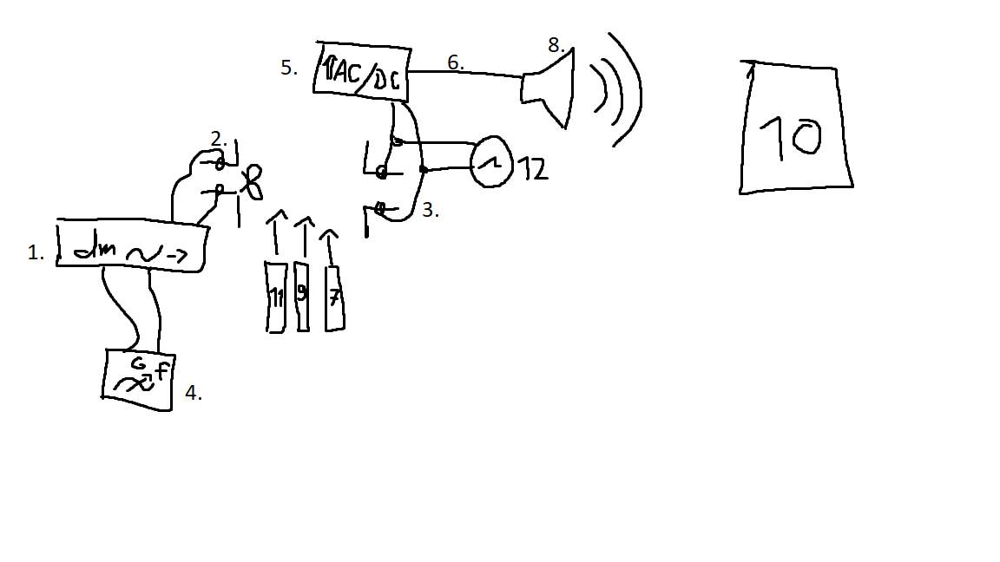

# Amplitudenmodulation von Dezimeterwellen (dm)

## Material

1. Dezimeterwellensender (DMWS)
2. Schleifendipol
3. Empfangsdipol
4. Funktionsgenerator
5. AC/DC Verstärker
6. Kabel
7. 2x Lehrbuch
8. Breitbandlautsprecher
9. Metalltafel
10. Handy mit Phyphox
11. Betonwand
12. Oszilloskop

## Versuchsaufbau

## Zweck

* Radioähnlich
    * geeignet zum Erklären
* Kabellose Funkwellenübertragung ist Themenrelevant und Interessant

## Hypothese

* Frequenz des Funktionsgenerators aus dem Lautsprecher hörbar und mit Phyphox messbar
* Objekte im Weg stören Übertragung
    * Metall stärker als Lehrbuch

## Durchführung

* DMWS angeschaltet und auf AM (Amplitudenmodulation) gestellt (weiterführende Tests mit FM möglich)
* Funktionsgenerator mit A_max in Betrieb genommen (beliebige Frequenz)
* Verstärker aufdrehen, bis der Ton zu hören ist
* Frequenz am Funktionsgenerator ändern
* Lautsprecherfrequenz mit Phyphox feststellen
* Distanz zwischen Dipolen verändern
* Objekte zwischen Dipole bringen
* Dipole auf zwei Seiten einer Wand stellen

## Beobachtung

* Eingestellte Frequenz mit kleinen Abweichungen mit Phyphox messbar
* Lehrbücher im Weg stören Signal
    * 1 Lehrbuch -> sehr leise
    * 2 Lehrbücher -> nicht hörbar
    * Metalltafel -> sehr leise
    * Betonwand -> Auch mit Oszilloskop kein Signal messbar
    * Je näher an Empfänger, desto stärker Dämpfung
* Metalltafel Kontakt mit Empfängerdipol -> stärkeres Signal
    * Messbares Signal durch Betonwand, wenn Metalltafel an Empfängerdipol

## Physikalischer Kontext

Die Nutzschwingung von 4. wird von 1. auf Trägerschwingung modelliert und von 2. als EM-Welle gesendet. Anschließend empfängt 3. die EM-Wellen und entfernt mit Drosselspulen die hochfrequente Trägerschwingung. Die verbleibende Nutzschwingung wird von 5. verstärkt und dann von 8. in ein Audiosignal umgewandelt. Deswegen ist mit 10. dieselbe Schwingung messbar, die auch an 4. eingestellt wurde.
Die elektromagnetischen Wellen werden von Objekten absorbiert, weswegen Hindernisse zwischen den Dipolen das Signal stören. Breitere Objekte stören stärker als schmalere, was auf Absorbtion und keine Reflektion schließen lässt. Dabei ist die Betonwand ein so starker Isolator, dass nicht einmal mit 12. ein Signal zu messen ist. Zusätzlich absorbieren ferromagnetische Stoffe stärker als andere, da sie potenter sind, die Wellen per induktion und ohmschen Widerstand in Wärmeenergie umzuwandeln. 
Dazu sendet der Sender in einem breiteren Kegel, als der Empfänger empfangen kann. Deswegen ist die Dämpfung auch stärker, wenn man die Hindernisse näher an den Empfänger bringt. 
Die Metalltafel dient im Kontakt mit dem Empfängerdipol als Erweiterung der Antenne und diese hat einen kürzeren Abstand vom Schleifendipol, als die ursprüngliche Antenne. Daher wird das Signal verstärkt und kann auch durch die Betonwand brechen.